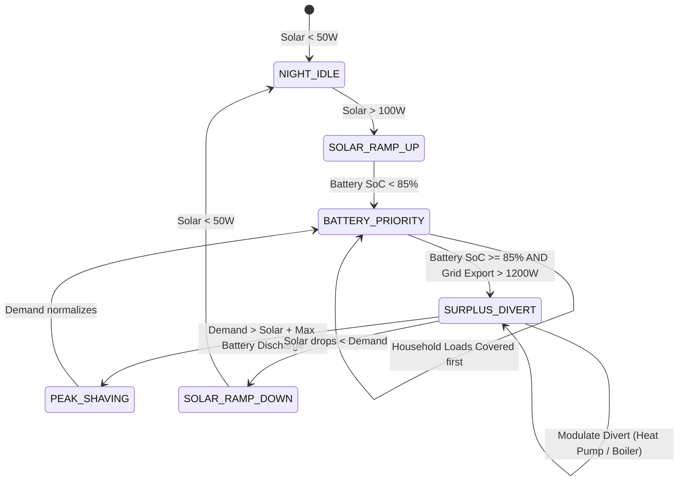

# SolarHub — Deep Technical Architecture & System Specifications

This document provides the in-depth engineering specification for the **SolarHub Dual-Inverter Energy Management Platform**, covering physical bus hardware, real-time message contracts, containerization on Proxmox VE, deterministic load-balancing state machines, and Model Context Protocol (MCP) agent tooling.

---

## 1. Domain Problem & Multi-Inverter Topography

Modern distributed solar installations frequently operate with **asymmetric, heterogeneous inverter topologies**:
* **Primary Inverter (Hybrid):** Grid-tied, bidirectional battery storage management, dynamic anti-islanding, and zero-export grid limiting.
* **Secondary Inverter (Off-Grid / Auxiliary):** Dedicated auxiliary PV strings, feeding dedicated sub-panels or supplemental battery charging.

```
       [ PV Array 1: 4.2 kWp ]               [ PV Array 2: 2.2 kWp ]
                 │                                     │
                 ▼                                     ▼
      ┌─────────────────────┐               ┌─────────────────────┐
      │ Inverter A (Hybrid) │               │Inverter B (Off-Grid)│
      │   High-Voltage DC   │               │   Low-Voltage DC    │
      └──────────┬──────────┘               └──────────┬──────────┘
                 │ (RS485 Port 1)                      │ (RS485 Port 2)
                 │                                     │
                 └──────────────┐       ┌──────────────┘
                                ▼       ▼
                   ┌───────────────────────────────┐
                   │ Edge Bridge: BL602 / ESP32-S3 │
                   │  - Galvanic Bus Isolation     │
                   │  - UART DMA Frame Buffering   │
                   │  - WiFi / Ethernet Transport  │
                   └───────────────┬───────────────┘
                                   │ MQTT over TLS (QoS 1)
                                   ▼
                   ┌───────────────────────────────┐
                   │  Proxmox VE (LXC Container)   │
                   │  - Mosquitto MQTT Broker      │
                   │  - Telemetry Ingest Engine    │
                   │  - Load Balancer State Machine│
                   │  - SolarHub MCP Server        │
                   └───────────────┬───────────────┘
                                   │ Model Context Protocol (JSON-RPC)
                                   ▼
                   ┌───────────────────────────────┐
                   │ Autonomous AI Agent / LLM     │
                   └───────────────────────────────┘
```

### Key Architectural Challenges Solved
1. **Asynchronous Polling Desynchronization:** Primary and secondary inverters emit frames with mismatched cycle times (e.g., Inverter A at 1.0s, Inverter B at 2.5s). The ingestion pipeline normalizes these streams into a sliding-window time-series buffer.
2. **Local-First Zero-Cloud Autonomy:** High-speed load balancing must continue uninterrupted during internet outages. All decision heuristics run in-process on the local Proxmox host.
3. **AI Introspection Without Safety Compromise:** Language Models have real-time visibility into microgrid metrics via MCP but cannot directly flash firmware or bypass emergency hardware breakers.

---

## 2. Hardware Edge Layer & Physical Bus Protocol

### 2.1 Microcontroller Specifications
* **Chipsets:** Bouffalo Lab BL602 (32-bit RISC-V @ 192 MHz) or ESP32-S3 (Dual-Core Xtensa LX7 @ 240 MHz).
* **Memory Footprint:** 276 KB SRAM, 4 MB Flash.
* **Firmware Runtime:** FreeRTOS with lightweight event loops and direct hardware UART rings.

### 2.2 Serial Bus & Electrical Characteristics
* **Transceiver:** MAX485 / SP3485 with automatic direction control (DE/RE).
* **Galvanic Isolation:** B0505S DC-DC converter with optocouplers on TX/RX lines to prevent ground loop currents between inverters and the edge bridge.
* **Baud Rate:** 9600 bps (8 data bits, 1 stop bit, no parity) with 50 ms turnaround inter-frame delay.

---

## 3. MQTT Message Contracts & Topic Hierarchy

### 3.1 Topic Namespace
```text
solarhub/
├── telemetry/
│   ├── inverters/
│   │   ├── inverter_a/raw          # Instantaneous metrics from Hybrid unit
│   │   └── inverter_b/raw          # Instantaneous metrics from Off-grid unit
│   └── aggregated/live             # Consolidated microgrid metrics (sub-second)
├── control/
│   ├── inverter_a/command          # Validated control directives
│   └── load_management/relays     # Auxiliary load switching (boilers, heat pumps)
└── system/
    ├── heartbeat                   # Bridge liveness watchdog (every 5s)
    └── alerts                      # Critical hardware alarms & fault codes
```

### 3.2 Sample Inverter Telemetry Payload (`solarhub/telemetry/inverters/inverter_a/raw`)
```json
{
  "inverter_id": "INV_A_HYBRID",
  "inverter_type": "HYBRID",
  "timestamp": "2026-10-05T12:00:00.124Z",
  "pv": {
    "string_1_voltage_v": 348.2,
    "string_1_current_a": 5.4,
    "string_2_voltage_v": 352.1,
    "string_2_current_a": 4.8,
    "total_pv_power_w": 3569.5
  },
  "battery": {
    "voltage_v": 53.2,
    "current_a": 28.5,
    "power_w": 1516.2,
    "soc_percent": 91.5,
    "soh_percent": 98.2,
    "temperature_c": 28.4,
    "state": "CHARGING"
  },
  "ac_grid": {
    "voltage_v": 231.8,
    "frequency_hz": 49.98,
    "active_power_w": 1205.0,
    "direction": "EXPORT"
  },
  "household_load_w": 848.3,
  "internal_temp_c": 41.2,
  "alarms": []
}
```

### 3.3 Sample Aggregated Telemetry Payload (`solarhub/telemetry/aggregated/live`)
```json
{
  "timestamp": "2026-10-05T12:00:00.500Z",
  "total_solar_production_w": 5210.0,
  "total_household_demand_w": 1260.0,
  "net_grid_power_w": 2150.0,
  "grid_state": "EXPORTING_SURPLUS",
  "combined_battery_soc": 89.8,
  "total_battery_charge_w": 1800.0,
  "self_consumption_index": 1.0,
  "surplus_available_for_diversion_w": 2150.0,
  "active_relays": ["RELAY_01_HEAT_PUMP_LOW"]
}
```

---

## 4. Deterministic Load Balancing & State Machine

The core state engine continuously evaluates excess photovoltaic generation against storage reserves to drive automated smart load relays.



### Dispatch Priority Rules:
1. **Tier 1 (Critical):** Household domestic circuits are served instantaneously via inverter AC output.
2. **Tier 2 (Storage):** Battery charging is prioritized until State of Charge reaches `85%`.
3. **Tier 3 (Controllable Surplus):** When grid export exceeds `1200 W` for more than 60 consecutive seconds, auxiliary relays trigger:
   * **Stage 1 (1000 W):** Domestic water heater immersion element.
   * **Stage 2 (1800 W):** Heat pump thermal storage charging.
   * **Stage 3 (3000 W+):** Electric Vehicle (EV) dynamic charge rate stepping.
4. **Tier 4 (Export):** Any remaining surplus flows into the national grid under net-metering contracts.

---

## 5. Proxmox VE Infrastructure & Deployment Model

SolarHub runs inside an isolated Proxmox LXC Container optimized for minimum resource utilization and high resilience:

### 5.1 Container Specifications
* **Container ID:** Proxmox CT 110 (`solarhub`)
* **Base OS:** Debian 12 (Bookworm Minimal)
* **Resource Quota:** 1 vCPU, 512 MB RAM, 4 GB NVMe storage
* **Internal IP:** `192.168.10.232` (Dedicated IoT Management VLAN)

### 5.2 System Services (systemd)
* `solarhub-ingest.service`: Asynchronous Python daemon handling MQTT subscription, sliding-window buffering, and state calculations.
* `mosquitto.service`: Local lightweight MQTT broker configured with client certificate authentication and TLS termination.
* `solarhub-mcp.service`: Model Context Protocol server exposing JSON-RPC tooling over stdio / HTTP socket.

---

## 6. Model Context Protocol (MCP) Tool Suite

The platform equips autonomous AI assistants with a specialized tool catalog:

| MCP Tool Name | Description | Safety Level |
| :--- | :--- | :--- |
| `solarhub_status` | Returns instantaneous health, aggregated energy balances, and battery reserves. | **Read-Only** |
| `solarhub_mqtt_inspect` | Subscribes to raw telemetry topics and returns a stream sample for anomaly diagnosis. | **Read-Only** |
| `solarhub_logs` | Fetches systemd service logs and edge bridge connection metrics. | **Read-Only** |
| `solarhub_send_command` | Dispatches validated operational directives (e.g., trigger emergency relay, change charge limit). | **Audited Action** |
| `solarhub_service_control`| Restarts or reloads SolarHub daemons on Proxmox CT 110 via SSH backend. | **Administrative** |
| `solarhub_run_tests` | Executes automated integration tests against simulated inverter feeds. | **Safe Execution**|

### Example AI Agent Introspection Step
```json
{
  "tool_call": "solarhub_status",
  "arguments": {"include_raw_telemetry": true},
  "agent_reasoning": "Inspecting current solar production before scheduling laundry and hot water pre-heating.",
  "response": {
    "status": "OPTIMAL_OPERATION",
    "total_pv_w": 5270.0,
    "combined_soc": "90.2%",
    "net_export_w": 2150.0,
    "diversion_capacity_w": 2150.0,
    "recommendation": "Surplus allows immediate activation of high-draw appliances with zero grid penalty."
  }
}
```
