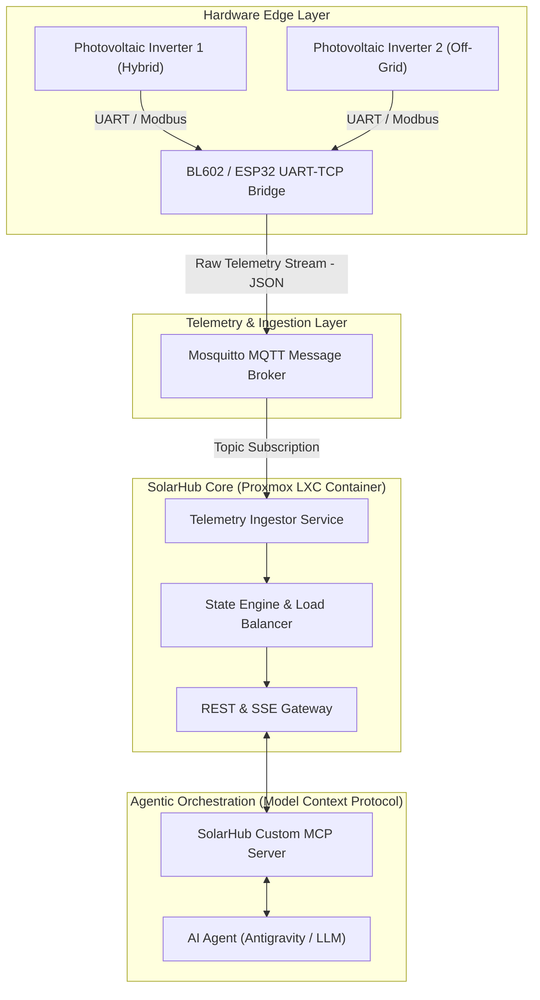

# SolarHub — Architecture Showcase & Interface Specification

[](#)
[](#)
[](#)
[](#)

> **Public Specification & Architectural Showcase**  
> This repository presents the architectural blueprint, data contracts, abstract interfaces, and AI/MCP orchestration layers of the **SolarHub Dual-Inverter Energy Management Platform**.  
> *Proprietary low-level hardware drivers, industrial bus routines, and production secrets are intentionally abstracted into clean interfaces.*

---

## 🏛️ System Architecture

SolarHub is an event-driven, microservices-based distributed platform designed for real-time monitoring, intelligent load management, and autonomous AI-assisted operations across multi-inverter solar topologies.



---

## 🌟 Key Architecture Pillars

1. **Decoupled Edge Telemetry:** Microcontrollers (ESP32 / Bouffalo Lab BL602) extract raw serial metrics from inverters over galvanically isolated RS485 buses and publish structured JSON frames via MQTT.
2. **Deterministic State Processing:** The core engine processes multi-inverter telemetry at sub-second intervals, computing combined yields, battery SoC/SoH curves, and grid feed-in states with zero external cloud reliance.
3. **Model Context Protocol (MCP) Integration:** Exposes audited, type-safe tooling to AI coding assistants and autonomous agents, allowing LLMs to inspect solar production, query historical performance, and recommend optimal storage discharge profiles.
4. **Lightweight Containerization:** High-density deployment on Proxmox VE (LXC Container CT 110) with minimal footprint (< 512 MB RAM) and local-first persistence.

---

## ⚡ Smart Load Balancing Priority Tiers

The deterministic state machine orchestrates power routing across 4 priority levels based on solar generation and battery reserve:

| Priority Tier | Destination | Condition | Action |
| :--- | :--- | :--- | :--- |
| **Tier 1 (Critical)** | Domestic Circuits | Continuous | Real-time AC supply to household circuits |
| **Tier 2 (Storage)** | Battery Banks | SoC < 85% | Dynamic charging priority (up to max C-rate) |
| **Tier 3 (Surplus Divert)**| Smart Relays (Immersion / Heat Pump)| Grid Export > 1200W & SoC ≥ 85% | Automated activation of thermal storage loads |
| **Tier 4 (Export)** | National Grid | All local demands satisfied | Controlled grid feed-in under net-metering contracts |

---

## 🤖 Model Context Protocol (MCP) Tool Suite

SolarHub provides an AI Agent interface implementing the open Model Context Protocol standard:

| Tool Name | Scope | Description |
| :--- | :--- | :--- |
| `solarhub_status` | Read-Only | Consolidated health, aggregated generation, and battery reserves. |
| `solarhub_mqtt_inspect` | Read-Only | Live stream sample of raw inverter topics for anomaly detection. |
| `solarhub_logs` | Read-Only | Systemd service logs from Proxmox CT 110 container. |
| `solarhub_send_command` | Audited Action | Dispatches validated directives to hardware relays and charge limits. |
| `solarhub_service_control`| Administrative | Manages daemon lifecycles via secure SSH backend. |
| `solarhub_run_tests` | Verification | Runs automated integration tests against simulated inverter feeds. |

---

## 🖥️ Proxmox LXC Deployment Specs

* **Container ID:** Proxmox CT 110 (`solarhub`)
* **Operating System:** Debian 12 (Bookworm Minimal)
* **Resource Profile:** 1 vCPU, 512 MB RAM, 4 GB NVMe
* **Network Isolation:** Dedicated IoT VLAN (`192.168.10.x`) with TLS-secured Mosquitto MQTT broker

---

## 📂 Repository Structure

```text
├── README.md                  # System overview and high-level architecture
├── ARCHITECTURE.md            # Deep-dive engineering specifications & message contracts
├── LICENSE                    # Apache 2.0 Open Specification License
├── src/
│   ├── __init__.py
│   ├── models.py              # Pydantic / Data contracts for telemetry & power flows
│   ├── interfaces.py          # Abstract interfaces (Bridge, Ingestion, MCP Handler)
│   ├── stubs.py               # Concrete service stubs with documented signatures
│   └── mcp_spec.py            # Model Context Protocol tool declarations for AI agents
└── examples/
    └── simulated_demo.py      # Standalone runnable demo with simulated multi-inverter telemetry
```

---

## 🚀 Running the Quick Simulation

You can verify the data structures, state aggregation, and MCP agent execution locally with zero hardware:

```bash
# Clone the repository
git clone https://github.com/RedScorpio83/solarhub-architecture-showcase.git
cd solarhub-architecture-showcase

# Run the standalone demonstration (standard library only)
python examples/simulated_demo.py
```

### Example Simulation Output:
```text
======================================================================
  SOLARHUB ARCHITECTURAL SHOWCASE -- SIMULATION DEMO
  Author: Alessandro Caliciotti (@RedScorpio83)
======================================================================

[1/4] Initializing Hardware Bridge and State Engine...
      [OK] Serial-over-TCP bus connected successfully.

[2/4] Ingesting Live Telemetry from Inverter A (Hybrid)...
      • Inverter A: PV=3450.0W | Battery=92.5% | Grid Feed=1400.0W

[3/4] Ingesting Live Telemetry from Inverter B (Supplemental)...
      • Inverter B: PV=1820.0W | Battery=88.0% | Load=420.0W

---------------- AGGREGATED MICROGRID BALANCE ----------------
  • Total Solar Generation:   5270.0 W
  • Total Household Demand:   1270.0 W
  • Combined Battery Storage: 90.2%
  • Net Grid Balance:         1400.0 W (Exporting)
  • Self-Sufficiency Index:   YES (100% Autonomous)
  • System Status:            OPTIMAL_OPERATION

[4/4] Model Context Protocol (MCP) Tool Execution by AI Agent...
      Agent invokes: 'solarhub_status'
      Result: {'status': 'success', 'total_production_w': 5270.0, 'combined_battery_soc': '90.25%'}
      Agent invokes: 'solarhub_load_balance_recommendation'
      Recommendation: {'recommendation_active': True, 'action': 'ENABLE_SURPLUS_WATER_HEATING'}
```

---

## 🛡️ Intellectual Property & Interface Isolation

* **Publicly Disclosed:** System topology, data schemas, abstract class hierarchies, MQTT topic trees, MCP tool specs, and simulation benches.
* **Encapsulated & Protected:** Low-level register maps, proprietary CRC-16 hardware checksum algorithms, and private network credentials.

---

## 📖 Further Reading

For detailed electrical schematics, message payload JSON schemas, and state machine transition rules, see:  
👉 **[ARCHITECTURE.md](ARCHITECTURE.md)**

---

## 👨‍💻 Author

**Alessandro Caliciotti**  
*Lead Enterprise Solutions & AI Systems Architect*  
* [GitHub: @RedScorpio83](https://github.com/RedScorpio83)
